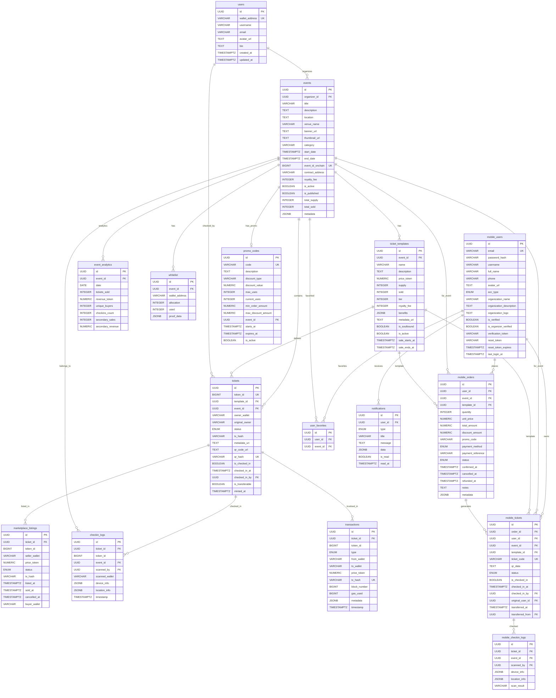

# NFT Ticket System - Database Diagram

## Entity Relationship Diagram

## Smart Contracts Architecture

## System Flow

## Enums Reference

| Enum Name | Values |
|-----------|--------|
| `ticket_status` | minted, listed, sold, checked_in, transferred, burned, cancelled |
| `listing_status` | active, sold, cancelled |
| `transaction_type` | mint, transfer, list, unlist, sale, burn |
| `account_type` | user, organizer, admin |
| `order_status` | pending, confirmed, cancelled, refunded, failed |
| `payment_method` | card, momo, zalopay, vnpay, bank_transfer, free |
| `mobile_ticket_status` | valid, used, cancelled, expired, transferred |
| `notification_type` | order_confirmed, ticket_ready, event_reminder, event_update, promo, system |

## Notes

### Two-Layer Architecture:

1. **Blockchain Layer (NFT)**: 
   - For Web3 users with wallet
   - NFT-based tickets on-chain
   - Decentralized ownership
   - Secondary marketplace with royalties

2. **Mobile Layer (Traditional)**:
   - For mobile users with email/password
   - Database-based tickets
   - Traditional payment methods
   - Simpler UX for mainstream users

### Shared Tables:
- `events` - Used by both layers
- `ticket_templates` - Used by both layers

### Sync Mechanism:
- Indexer syncs blockchain events to database
- Enables hybrid Web2/Web3 experience
